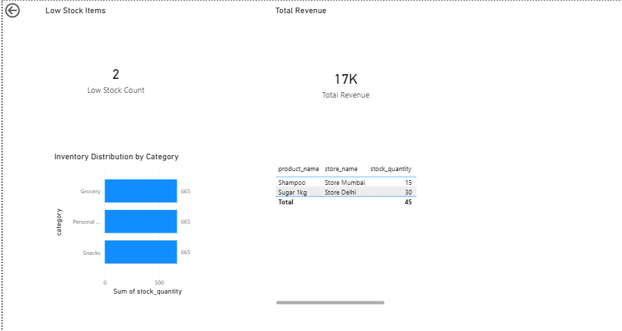
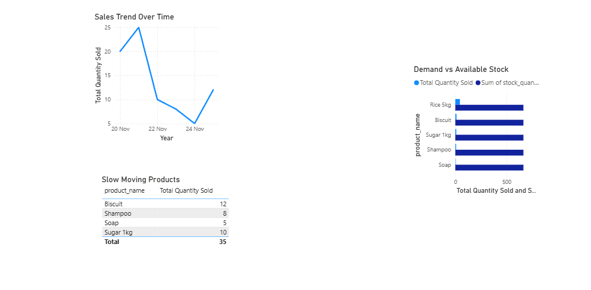

# Retail Inventory Analytics (SQL + Power BI)

Project Overview
This project focuses on analyzing retail inventory and sales data to help businesses
identify low stock items, understand demand patterns, and evaluate store performance.
The analysis is performed using SQL for data preparation and Power BI for visualization.

Tools & Technologies
- MySQL (Data storage & SQL analysis)
- Power BI (Data modeling, DAX, dashboards)
- CSV files (Data source)

Dataset Description
The project uses the following tables:
- products: Product details like category and pricing
- stores: Store and city information
- inventory: Stock levels and reorder thresholds
- sales: Daily sales transactions

Key Analysis Performed
- Identified low stock products using inventory thresholds
- Analyzed sales trends to understand demand over time
- Detected slow-moving products
- Compared demand vs available stock
- Evaluated store-wise revenue and performance

Dashboard Preview

Inventory Overview

Demand vs Supply

Store Performance

Outcome
The dashboard provides clear insights that can help retail managers:
- Reduce stock-out risk
- Improve inventory turnover
- Focus on underperforming products and stores
